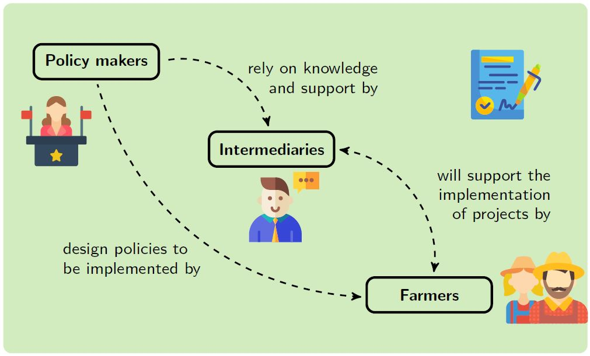
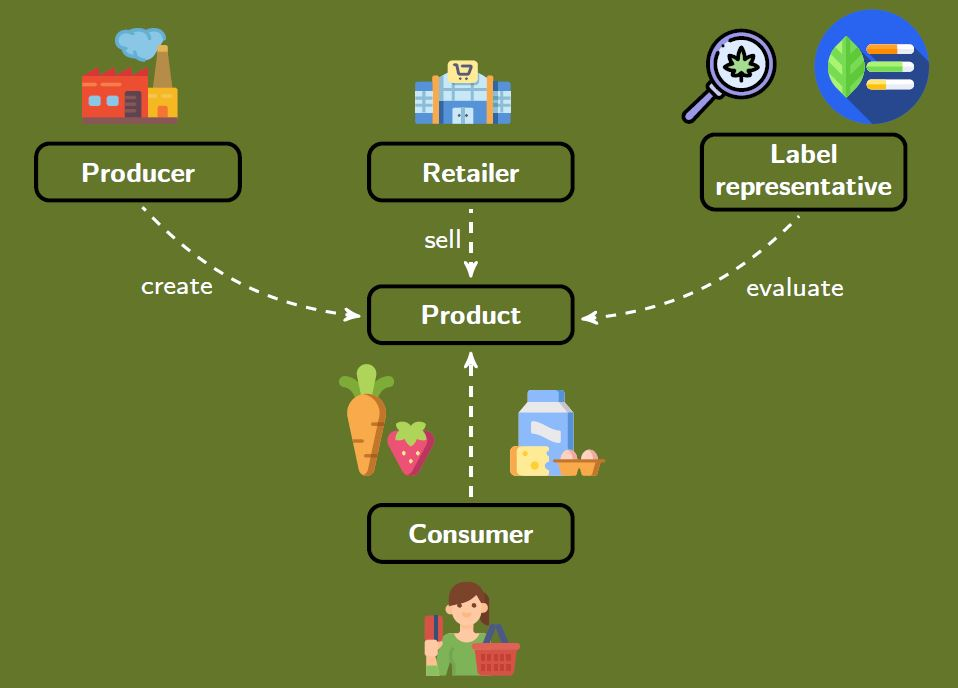

My current research activities are linked to the AgoraNatura project <a href="https://agora-natura.de/">(click here for more info)</a>, in which I am responsible for investigating land managers' preferences for privately financed *Payments for Ecosystem Services* schemes. 

Doing so, I will both apply qualitative and quantitative methods, such as Q-methodology and Discrete Choice Experiments. For the moment being, my PhD dissertation will be built up upon the following three publications:

#### <u>Discrete Choice Experiments informing environmental policies - A systematic review</u>
*Approaching the question of how Discrete Choice Experiments have been used to inform environmental policies, specically the design of Payments for Ecosystem Services schemes. The focus of this review will be placed on studies conducted with providers of Ecosystem Services, such as farmers, land managers or other individuals that actively shape agricultural landscapes on this planet. In this review we exhaustively analyse the institutional settings of the studies by comparing land use restrictions and contract design features of the individual publications.*

        <a href="../assets/test.html">
            <iframe src="../assets/test.html" width="800" height="400"></iframe></a>
        

#### <u>Stakeholder attitudes towards Payments for Ecosystem Services scheme design</u>
*Using Q-methodology, I will analyse stakeholder attitudes towards institutional design features of Payments for Ecosystem Services schemes to identify factors affecting farmers' uptake of conservation policies. The particular interest here is to find out, whether there exist policy mismatches between different stakeholder groups. For the context of this study, I interview farmers, policy makers and intermediaries, who facilitate the implementation of policy schemes.*

        
        

#### <u>Institutional design of privately financed Payments for Ecosystem Services schemes</u>
*Conducting a Discrete Choice Experiment survey with German farmers, I will analyse landowners' preferences for the institutional design of privately financed Payments for Ecosystem Services schemes.*

---
### Current work in progress
#### <u>Using product labels to stimulate the provision of ecosystem services along the value chain - stakeholder perceptions</u>
In this study, we apply Q-methodology to analyse stakeholder perceptions towards the potential to introduce product labels to inform about consumers about generated ecosystem services along the value chain. This is part of the EU financed project *Contracts2.0*. We conduct interviews with food producers, retailers and farmers' organisations across Germany, Poland and Spain. This will be followed up by a large scale consumer choice experiment in Europe. 

        
        

#### <u>Preference analysis for novel contract models in EU agri-environmental policy</u>
Apart from AgoraNatura, I am also involved in the EU project <a href="https://www.project-contracts20.eu/">"*Contracts2.0 - Co-design of novel contract models for innovative agri-environmental-climate measures and for valorisation of environmental public goods"*</a>. My contribution here lies within modelling public preference and analysis of perceptions of label-based approaches to stimulate the provision of ecosystem services within the value chain. To achieve this, we will apply Discrete Choice Experiments and Economic Experiments to assess cooperation among farmers and their incentives to do so.  

        
        

        
---
### Other research activities
#### <u>Public preferences for peatland restoration in Scotland</u>
The dissertation of my Master's degree in Ecological Economics dealt with a public preference survey in Scotland, regarding restoration policies of peatlands. I was not involved in the design of the experiment (courtesy of Julia Martin-Ortega, Michela Faccioli and Klaus Glenk), but had the chance to be the first person doing analysis with the data. The focus of my dissertation were peoples time preferencs for peatland restoration and the role of framing effects of how restoration policies are presented to the public. The open access link to the published study can be found <a href="https://doi.org/10.1016/j.gloenvcha.2021.102323">here</a>.

<!--[click here for the most recent version of the paper]({{ BASE_PATH}}/pages/working_papers/sample-working-paper.pdf)-->

<!-- Note: this is how to write a comment in HTML. Everything in here won't show up on your webpage.-->

<!--
To increase the size of the title, use fewer # in front of the paper title.
To decrease the size of the title, use more #. 
To remove the italics, remove the * before and after the description
To remove the underline from the title, remove the <u> tags (<u> and </u>)
-->
